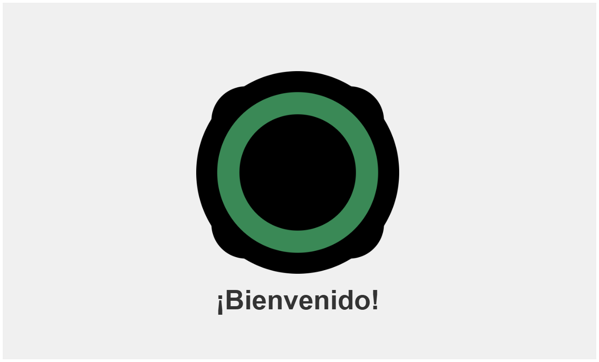
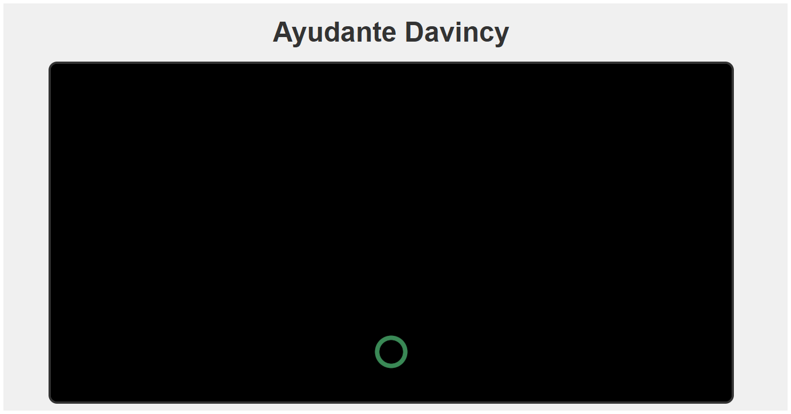
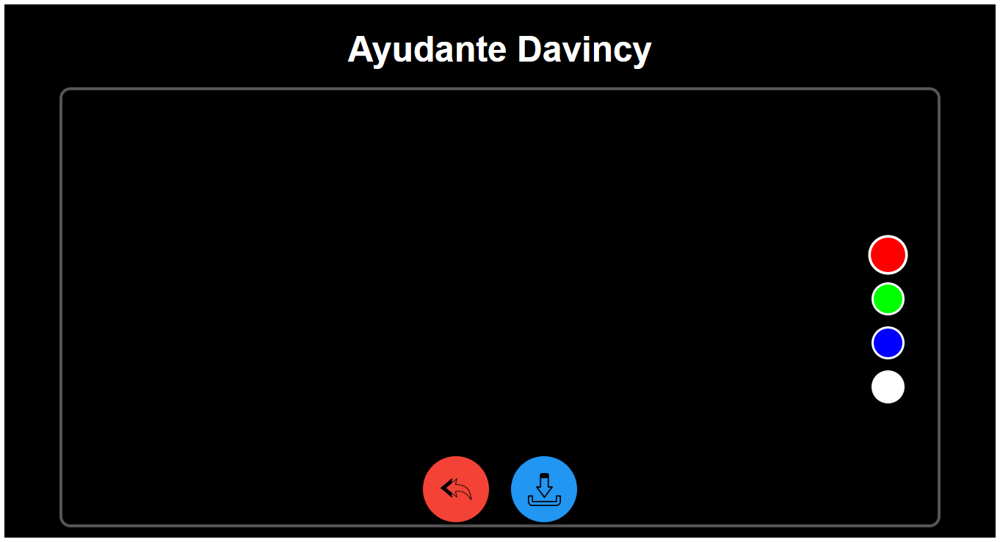

# 📷 Ayudante Da Vinci - Proyecto de Cámara con Dibujo

Una aplicación web moderna que combina captura de fotos con herramientas de dibujo, inspirada en el espíritu creativo de Leonardo Da Vinci.

## 🌟 Características principales

- **Captura de fotos** usando la cámara del dispositivo
- **Herramientas de dibujo** con múltiples colores
- **Soporte táctil** para dispositivos móviles
- **Modo edición** para decorar tus fotos
- **Descarga de imágenes** con los dibujos incluidos
- **Diseño responsive** que funciona en cualquier dispositivo

## 🛠 Tecnologías utilizadas

- 
- 
- 
- 
- 

## Ilustraciones
 <!-- Añade tu propia captura -->
 <!-- Añade tu propia captura -->
 <!-- Añade tu propia captura -->
 <!-- Añade tu propia captura -->


## 🚀 Cómo empezar

### Prerrequisitos
- Navegador moderno (Chrome 80+, Firefox 75+, Edge 80+, Safari 13.1+)
- Acceso a la cámara (para funcionalidad completa)

### Instalación local
1. Clona el repositorio:
   ```bash
   git clone https://github.com/tu-usuario/ayudante-davinci.git

# Enlace de la app
- https://davincicam.netlify.app/

