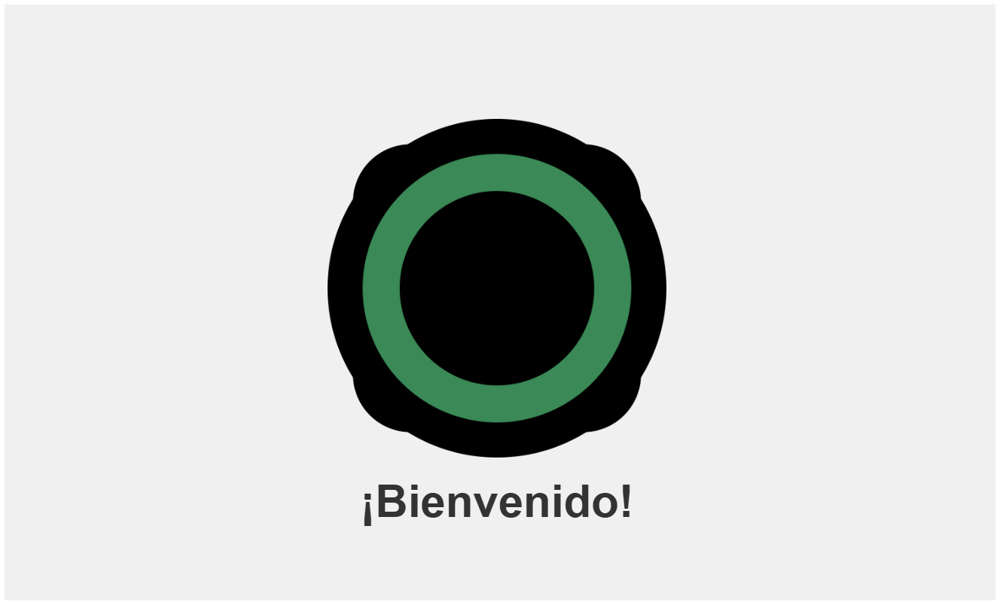
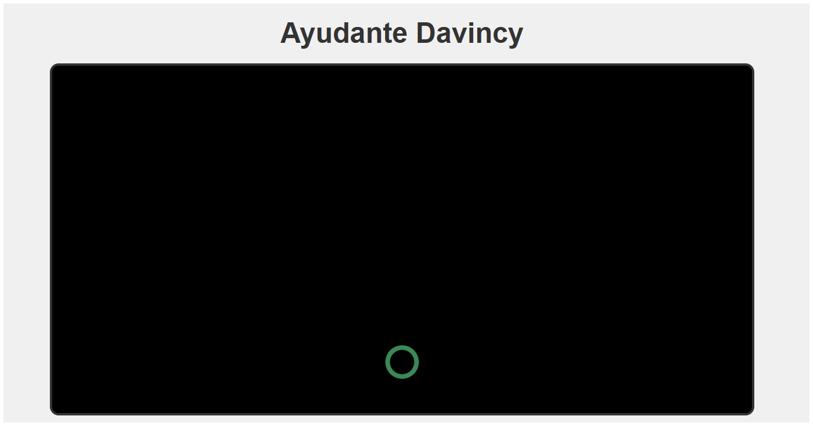
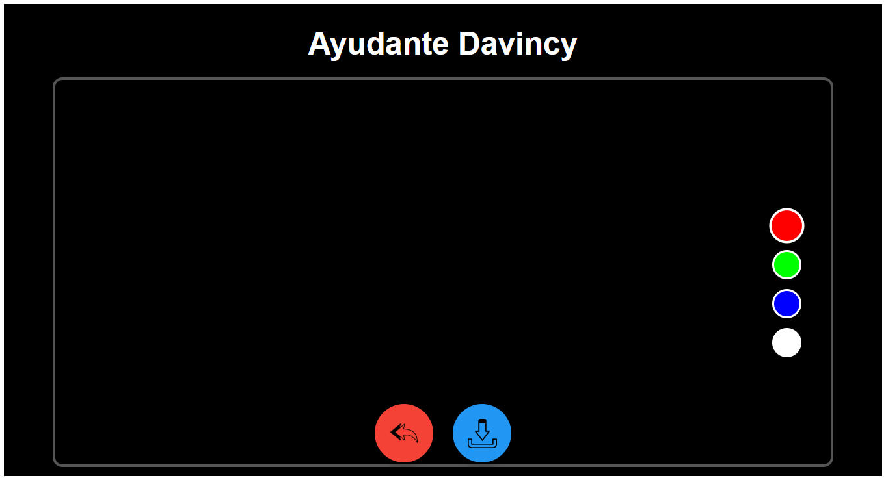

# 📷 Ayudante Da Vinci - Proyecto de Cámara con Dibujo

Una aplicación web moderna que combina captura de fotos con herramientas de dibujo.

## 🌟 Características principales

- **Captura de fotos** usando la cámara del dispositivo
- **Herramientas de dibujo** con múltiples colores
- **Soporte táctil** para dispositivos móviles
- **Modo edición** para decorar tus fotos
- **Descarga de imágenes** con los dibujos incluidos
- **Diseño responsive** que funciona en cualquier dispositivo

## 🛠 Tecnologías utilizadas

- 
- 
- 
- 
- 

## Ilustraciones
 <!-- Añade tu propia captura -->
 <!-- Añade tu propia captura -->
 <!-- Añade tu propia captura -->
 <!-- Añade tu propia captura -->

# Enlace de la app
- https://davincicam.netlify.app/

## 🎨 Uso de la aplicación
Pantalla inicial: Haz clic en "Comenzar"

### Modo cámara:

- Toca el botón de cámara para capturar foto

### Modo edición:

- Dibuja sobre tu foto con los colores disponibles

### Usa los botones inferiores para:

🔄 Volver a tomar foto

⬇️ Descargar la imagen editada

### Prerrequisitos
- Navegador moderno (Chrome 80+, Firefox 75+, Edge 80+, Safari 13.1+)
- Acceso a la cámara (para funcionalidad completa)

## 🌍 Compatibilidad
### Probado en:

✅ Chrome (Desktop y Android)

✅ Firefox

✅ Safari (iOS)

✅ Edge

## 🛑 Limitaciones conocidas
- En iOS, el formato de descarga es siempre JPEG

- El rendimiento de dibujo puede verse afectado en imágenes muy grandes

- Requiere HTTPS para funcionar en algunos navegadores móviles

## 🤝 Cómo contribuir
- Haz fork del proyecto

- Crea una rama (git checkout -b feature/nueva-funcionalidad)

- Haz commit de tus cambios (git commit -am 'Añade nueva funcionalidad')

- Haz push a la rama (git push origin feature/nueva-funcionalidad)

- Abre un Pull Request

✉️ Contacto
Creado por [Daniel Cazorla] - [dcazorla.0190@gmail.com]
